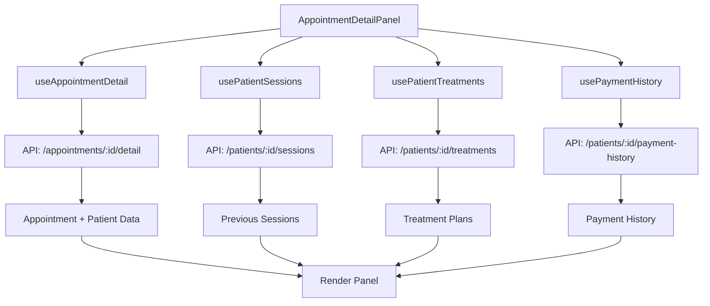

# Design Document: Appointment Detail Panel Enhancement

## Overview

This design enhances the AppointmentDetailPanel component to consolidate all patient-related information into a single, comprehensive view. Currently, doctors must navigate between multiple pages (AppointmentsPage, AppointmentDetailPanel, and PatientDetailPage) to access complete patient information during appointments. This enhancement eliminates that friction by bringing previous sessions, payment history, treatment recommendations, and comprehensive patient data into the appointment detail panel.

The enhancement maintains all existing functionality while adding four major information sections:
- Previous sessions history with photos
- Next appointment recommendations based on treatment plans
- Comprehensive payment information and history
- Consolidated patient contact and medical information

The design prioritizes performance through asynchronous data loading, maintains the existing scrollable layout pattern, and ensures all new sections follow the established UI patterns for consistency.

## Architecture

### Component Structure

The enhanced AppointmentDetailPanel will maintain its current structure while adding new child components:

```
AppointmentDetailPanel (existing)
├── Header (existing)
├── ScrollArea (existing)
│   ├── PatientInfoSection (existing - enhanced)
│   ├── PreviousSessionsSection (new)
│   ├── NextAppointmentSection (new)
│   ├── SessionDocumentationForm (existing)
│   ├── PhotoUploadComponent (existing)
│   ├── TreatmentInfoSection (existing)
│   ├── PaymentHistorySection (new)
│   └── MedicalHistorySection (existing)
```

### Data Flow



### API Integration

The design requires one new API endpoint and leverages existing endpoints:

**Existing Endpoints:**
- `GET /appointments/:id/detail` - Returns appointment with patient info, treatments, and session
- `GET /patients/:id/sessions?exclude_session_id=:id` - Returns previous sessions for a patient
- `GET /patients/:id/treatments` - Returns patient's treatment plans (via usePatientTreatments hook)

**New Endpoint Required:**
- `GET /patients/:id/payment-history` - Returns chronological payment history with appointment references

### State Management

The component will use React hooks for state management:
- `useAppointmentDetail(appointmentId)` - Existing hook for appointment data
- `usePatientSessions(patientId, excludeSessionId)` - New hook for previous sessions
- `usePatientTreatments(patientId)` - Existing hook for treatment plans
- `usePaymentHistory(patientId)` - New hook for payment history

Each hook manages its own loading, error, and data states independently to enable asynchronous loading without blocking.

## Components and Interfaces

### 1. Enhanced PatientInfoSection

**Purpose:** Display comprehensive patient contact information

**Props:**
```typescript
interface PatientInfoSectionProps {
  appointment: AppointmentDetailExtended;
}
```

**Enhancements:**
- Add phone number display (if available)
- Add email display (if available)
- Add date of birth display (if available)
- Add patient notes display (if available)
- Maintain existing patient name display

### 2. PreviousSessionsSection (New)

**Purpose:** Display all previous sessions in reverse chronological order

**Props:**
```typescript
interface PreviousSessionsSectionProps {
  patientId: string;
  currentSessionId: string | null;
}
```

**Component Structure:**
```typescript
export function PreviousSessionsSection({ 
  patientId, 
  currentSessionId 
}: PreviousSessionsSectionProps) {
  const { sessions, loading, error, refetch } = usePatientSessions(
    patientId, 
    currentSessionId
  );
  
  // Render loading skeleton, error state, or sessions list
}
```

**Data Structure:**
```typescript
interface PreviousSession {
  id: string;
  appointment_id: string;
  scheduled_at: string;
  procedures_performed: string;
  recommendations: string | null;
  created_at: string | null;
  photos?: SessionPhoto[];
}
```

**UI Layout:**
- Card-based layout matching existing sections
- Each session shows: date, procedures, recommendations
- Photos displayed in a horizontal scrollable gallery (if present)
- Empty state: "No hay sesiones anteriores registradas"

### 3. NextAppointmentSection (New)

**Purpose:** Display recommended next appointment dates based on treatment plans

**Props:**
```typescript
interface NextAppointmentSectionProps {
  patientId: string;
  currentAppointmentDate: string;
}
```

**Component Structure:**
```typescript
export function NextAppointmentSection({ 
  patientId, 
  currentAppointmentDate 
}: NextAppointmentSectionProps) {
  const { patientTreatments, loading, calculateNextAppointment } = 
    usePatientTreatments(patientId);
  
  const activeTreatments = patientTreatments.filter(pt => pt.is_active);
  
  // Calculate next appointment for each active treatment
  const recommendations = activeTreatments.map(pt => ({
    treatmentName: pt.treatment?.name,
    nextDate: calculateNextAppointment(pt, currentAppointmentDate),
    frequency: getFrequencyText(pt)
  }));
  
  // Render recommendations or empty state
}
```

**Calculation Logic:**
```typescript
function calculateNextAppointment(
  patientTreatment: PatientTreatment,
  currentDate: string
): Date | null {
  const treatment = patientTreatment.treatment;
  if (!treatment) return null;
  
  // Determine which frequency to use
  const isInitialPhase = 
    treatment.initial_sessions_count && 
    patientTreatment.current_session < treatment.initial_sessions_count;
  
  const frequencyWeeks = isInitialPhase
    ? treatment.initial_frequency_weeks
    : treatment.maintenance_frequency_weeks;
  
  if (!frequencyWeeks) return null;
  
  const current = new Date(currentDate);
  const next = new Date(current);
  next.setDate(next.getDate() + (frequencyWeeks * 7));
  
  return next;
}
```

**UI Layout:**
- Card with list of recommendations
- Each recommendation shows: treatment name, recommended date, frequency context
- Empty state: Hidden when no active treatments

### 4. PaymentHistorySection (New)

**Purpose:** Display comprehensive payment information and history

**Props:**
```typescript
interface PaymentHistorySectionProps {
  patientId: string;
  currentAppointmentId: string;
}
```

**Component Structure:**
```typescript
export function PaymentHistorySection({ 
  patientId, 
  currentAppointmentId 
}: PaymentHistorySectionProps) {
  const { history, summary, loading, error, refetch } = 
    usePaymentHistory(patientId);
  
  // Render summary card + history list
}
```

**Data Structures:**
```typescript
interface PaymentHistoryEntry {
  appointment_id: string;
  scheduled_at: string;
  payment_status: PaymentStatus;
  total_amount_cents: number;
  procedures_performed: string | null;
}

interface PaymentSummary {
  unpaid_count: number;
  unpaid_total_cents: number;
  total_paid_cents: number;
  total_appointments: number;
}
```

**UI Layout:**
- Summary card showing unpaid count and total owed (if > 0)
- Chronological list of all appointments with payment status
- Each entry shows: date, procedures, amount, payment status badge
- Empty state: "No hay historial de pagos"

### 5. usePatientSessions Hook (New)

**Purpose:** Fetch and manage previous sessions data

```typescript
export function usePatientSessions(
  patientId: string | null,
  excludeSessionId: string | null
) {
  const [sessions, setSessions] = useState<PreviousSession[]>([]);
  const [loading, setLoading] = useState(false);
  const [error, setError] = useState<Error | null>(null);
  
  const fetchSessions = useCallback(async () => {
    if (!patientId) return;
    
    setLoading(true);
    setError(null);
    
    try {
      const params = excludeSessionId 
        ? { exclude_session_id: excludeSessionId }
        : {};
      
      const response = await api.get(
        `/patients/${patientId}/sessions`,
        { params }
      );
      
      setSessions(response.data);
    } catch (err) {
      setError(err as Error);
    } finally {
      setLoading(false);
    }
  }, [patientId, excludeSessionId]);
  
  useEffect(() => {
    fetchSessions();
  }, [fetchSessions]);
  
  return { sessions, loading, error, refetch: fetchSessions };
}
```

### 6. usePaymentHistory Hook (New)

**Purpose:** Fetch and manage payment history data

```typescript
export function usePaymentHistory(patientId: string | null) {
  const [history, setHistory] = useState<PaymentHistoryEntry[]>([]);
  const [summary, setSummary] = useState<PaymentSummary | null>(null);
  const [loading, setLoading] = useState(false);
  const [error, setError] = useState<Error | null>(null);
  
  const fetchHistory = useCallback(async () => {
    if (!patientId) return;
    
    setLoading(true);
    setError(null);
    
    try {
      const response = await api.get(`/patients/${patientId}/payment-history`);
      setHistory(response.data.history);
      setSummary(response.data.summary);
    } catch (err) {
      setError(err as Error);
    } finally {
      setLoading(false);
    }
  }, [patientId]);
  
  useEffect(() => {
    fetchHistory();
  }, [fetchHistory]);
  
  return { history, summary, loading, error, refetch: fetchHistory };
}
```

## Data Models

### Extended Appointment Detail

The existing `AppointmentDetailExtended` type will be used, which already includes patient contact information:

```typescript
interface AppointmentDetailExtended extends AppointmentDetail {
  patient_phone: string | null;
  patient_email: string | null;
  patient_date_of_birth: string | null;
  patient_notes: string | null;
  photos?: SessionPhoto[];
  previous_sessions?: PreviousSession[];
}
```

### Previous Session

```typescript
interface PreviousSession {
  id: string;
  appointment_id: string;
  scheduled_at: string;
  procedures_performed: string;
  recommendations: string | null;
  created_at: string | null;
}
```

### Session Photo

```typescript
interface SessionPhoto {
  id: string;
  file_name: string;
  file_size_bytes: number;
  mime_type: string;
  uploaded_at: string | null;
  presigned_url: string;
}
```

### Payment History Entry

```typescript
interface PaymentHistoryEntry {
  appointment_id: string;
  scheduled_at: string;
  payment_status: PaymentStatus;
  total_amount_cents: number;
  procedures_performed: string | null;
}
```

### Payment Summary

```typescript
interface PaymentSummary {
  unpaid_count: number;
  unpaid_total_cents: number;
  total_paid_cents: number;
  total_appointments: number;
}
```

### Treatment Recommendation

```typescript
interface TreatmentRecommendation {
  treatmentName: string;
  nextDate: Date | null;
  frequencyWeeks: number | null;
  isInitialPhase: boolean;
}
```

## Correctness Properties

*A property is a characteristic or behavior that should hold true across all valid executions of a system—essentially, a formal statement about what the system should do. Properties serve as the bridge between human-readable specifications and machine-verifiable correctness guarantees.*

### Property 1: Previous sessions chronological ordering

*For any* patient with multiple previous sessions, the displayed sessions should be ordered in reverse chronological order (most recent first).

**Validates: Requirements 1.1**

### Property 2: Session data completeness

*For any* previous session, the rendered output should contain the session date, procedures performed, and recommendations (if present).

**Validates: Requirements 1.2, 3.4, 4.1, 4.2, 4.3, 4.4**

### Property 3: Current session exclusion

*For any* patient with sessions, when displaying previous sessions and providing a current session ID, the current session should not appear in the previous sessions list.

**Validates: Requirements 1.4**

### Property 4: Next appointment calculation accuracy

*For any* active treatment plan with frequency data, the calculated next appointment date should equal the current appointment date plus (frequency_weeks × 7) days.

**Validates: Requirements 2.1, 2.2**

### Property 5: Multiple treatment recommendations

*For any* patient with N active treatment plans, the panel should display exactly N next appointment recommendations.

**Validates: Requirements 2.3**

### Property 6: Treatment name in recommendations

*For any* treatment recommendation, the rendered output should contain the treatment name.

**Validates: Requirements 2.5**

### Property 7: Payment summary accuracy

*For any* set of appointments with payment statuses, the unpaid count should equal the number of appointments with payment_status='unpaid', and the unpaid total should equal the sum of total_amount_cents for those appointments.

**Validates: Requirements 3.2**

### Property 8: Payment history chronological ordering

*For any* patient with multiple payment history entries, the displayed entries should be ordered in reverse chronological order (most recent first).

**Validates: Requirements 3.3**

### Property 9: Payment status update propagation

*For any* appointment, when the payment status is updated through the panel, the API should be called with the new payment status value.

**Validates: Requirements 3.6**

### Property 10: Backward compatibility

*For any* appointment, all existing panel sections (header, session documentation, photo upload, treatment info, medical history) should remain present and functional after the enhancement.

**Validates: Requirements 5.1, 5.2, 5.3, 5.4, 5.5**

### Property 11: Data caching behavior

*For any* appointment, when it is selected, then deselected, then reselected, the second selection should not trigger new API calls for the same data.

**Validates: Requirements 6.5**

## Error Handling

### API Error Handling

Each new section will handle errors independently:

```typescript
// Pattern for error handling in new sections
if (error) {
  return (
    <Card>
      <CardContent className="py-8 text-center">
        <p className="text-sm text-destructive mb-3">
          Error al cargar {sectionName}
        </p>
        <Button variant="outline" size="sm" onClick={refetch}>
          Reintentar
        </Button>
      </CardContent>
    </Card>
  );
}
```

### Loading States

Each section will display skeleton loaders during data fetching:

```typescript
if (loading) {
  return (
    <Card>
      <CardHeader>
        <Skeleton className="h-5 w-32" />
      </CardHeader>
      <CardContent className="space-y-3">
        <Skeleton className="h-16 w-full" />
        <Skeleton className="h-16 w-full" />
      </CardContent>
    </Card>
  );
}
```

### Empty States

Each section will display appropriate empty state messages:

- Previous Sessions: "No hay sesiones anteriores registradas"
- Next Appointments: Section hidden when no active treatments
- Payment History: "No hay historial de pagos"

### Network Failures

- Failed API calls will display error messages with retry buttons
- Errors in one section will not block other sections from loading
- The main appointment detail will continue to function even if supplementary data fails to load

### Data Validation

- Null/undefined checks for all optional fields
- Date parsing with error handling using date-fns
- Amount calculations with safe number handling (cents to dollars)

## Testing Strategy

### Dual Testing Approach

This feature will use both unit tests and property-based tests for comprehensive coverage:

- **Unit tests**: Verify specific examples, edge cases, and error conditions
- **Property tests**: Verify universal properties across all inputs using fast-check library

### Property-Based Testing Configuration

- Library: fast-check (TypeScript property-based testing library)
- Minimum iterations: 100 per property test
- Each property test will reference its design document property using comments
- Tag format: `// Feature: appointment-detail-panel-enhancement, Property {number}: {property_text}`

### Unit Testing Focus

Unit tests will cover:
- Specific examples of date calculations
- Edge cases: empty arrays, null values, missing data
- Error handling: API failures, network errors
- Integration points: component mounting, prop changes
- User interactions: button clicks, form submissions

### Property-Based Testing Focus

Property tests will cover:
- Chronological ordering (Properties 1, 8)
- Data completeness (Property 2)
- Filtering logic (Property 3)
- Calculation accuracy (Property 4)
- Collection size invariants (Property 5)
- Aggregation accuracy (Property 7)
- API interaction patterns (Properties 9, 11)
- Backward compatibility (Property 10)

### Test Organization

```
frontend/src/components/appointments/__tests__/
├── AppointmentDetailPanel.test.tsx (existing - update)
├── PreviousSessionsSection.test.tsx (new)
├── NextAppointmentSection.test.tsx (new)
├── PaymentHistorySection.test.tsx (new)
├── AppointmentDetailPanel.properties.test.tsx (new - property tests)
└── calculateNextAppointment.test.tsx (new - unit tests for calculation)

frontend/src/hooks/__tests__/
├── usePatientSessions.test.tsx (new)
└── usePaymentHistory.test.tsx (new)
```

### Example Property Test Structure

```typescript
import fc from 'fast-check';

// Feature: appointment-detail-panel-enhancement, Property 1: Previous sessions chronological ordering
describe('Previous sessions ordering', () => {
  it('should display sessions in reverse chronological order', () => {
    fc.assert(
      fc.property(
        fc.array(arbitrarySession(), { minLength: 2 }),
        (sessions) => {
          const rendered = renderSessions(sessions);
          const dates = extractDates(rendered);
          
          // Verify reverse chronological order
          for (let i = 0; i < dates.length - 1; i++) {
            expect(dates[i]).toBeGreaterThanOrEqual(dates[i + 1]);
          }
        }
      ),
      { numRuns: 100 }
    );
  });
});
```

### Integration Testing

- Test complete panel rendering with all sections
- Test async data loading and race conditions
- Test error recovery and retry mechanisms
- Test caching behavior across component remounts

### Performance Testing

- Measure render time with large datasets (100+ sessions, payments)
- Verify async loading doesn't block UI
- Test scroll performance with many sections
- Monitor memory usage during data caching
