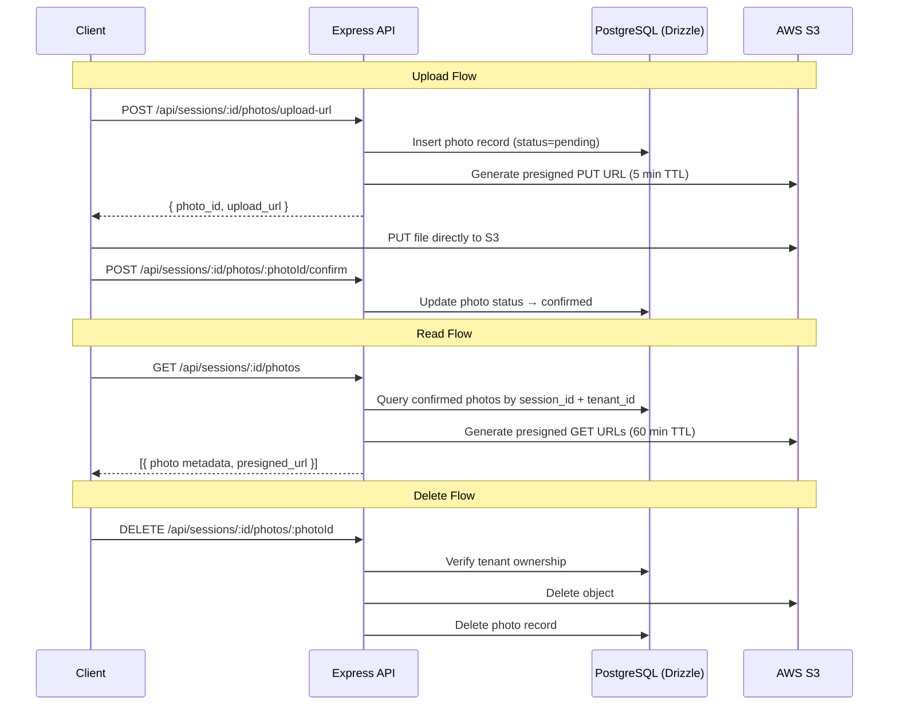

# Design Document: Appointment Session Photos

## Overview

This feature adds photo management to appointment sessions in AnamnesIA. Doctors can upload, view, and delete photos within a session record to visually track patient progress over time.

The design follows a presigned URL pattern: the backend generates time-limited S3 URLs for both upload and read operations, so photo bytes never pass through the application server. A two-phase upload flow (pending → confirmed) ensures only successfully uploaded photos appear in session views.

The feature integrates with the existing session detail view and follows the established multi-tenant isolation pattern used throughout the application.

## Architecture



### Key Design Decisions

- Presigned URLs keep photo bytes off the app server, reducing bandwidth and latency.
- The pending/confirmed status prevents incomplete uploads from appearing in session views.
- S3 key pattern `tenants/{tenant_id}/sessions/{session_id}/{uuid}_{filename}` enforces tenant isolation at the storage layer.
- A background job cleans up stale pending records (older than 1 hour) to avoid orphaned DB rows.
- S3 deletion failures are logged but do not block DB record removal, preventing orphaned metadata.

## Components and Interfaces

### Backend

**New route file:** `backend/src/routes/sessionPhotos.ts`  
Mounted at `/api/sessions/:sessionId/photos`

| Method | Path | Description |
|--------|------|-------------|
| POST | `/upload-url` | Generate presigned upload URL, create pending photo record |
| POST | `/:photoId/confirm` | Mark photo as confirmed after successful S3 upload |
| GET | `/` | List confirmed photos with presigned read URLs |
| DELETE | `/:photoId` | Delete photo record and S3 object |

**New service:** `backend/src/services/sessionPhotoService.ts`

```typescript
interface CreateUploadUrlInput {
  sessionId: string;
  patientId: string;
  tenantId: string;
  fileName: string;
  fileSizeBytes: number;
  mimeType: string;
}

interface SessionPhotoRow {
  id: string;
  session_id: string;
  tenant_id: string;
  patient_id: string;
  s3_key: string;
  file_name: string;
  file_size_bytes: number;
  mime_type: string;
  status: 'pending' | 'confirmed';
  uploaded_at: Date | null;
  created_at: Date | null;
}

interface SessionPhotoWithUrl extends SessionPhotoRow {
  presigned_url: string;
}

// Service functions
createUploadUrl(input: CreateUploadUrlInput): Promise<{ photo: SessionPhotoRow; upload_url: string }>
confirmUpload(tenantId: string, sessionId: string, photoId: string): Promise<SessionPhotoRow | null>
listPhotos(tenantId: string, sessionId: string): Promise<SessionPhotoWithUrl[]>
deletePhoto(tenantId: string, sessionId: string, photoId: string): Promise<void>
deleteStalePhendingPhotos(): Promise<number>  // called by background job
```

**New S3 utility:** `backend/src/utils/s3.ts`

```typescript
generateUploadPresignedUrl(key: string, mimeType: string, ttlSeconds: number): Promise<string>
generateReadPresignedUrl(key: string, ttlSeconds: number): Promise<string>
deleteObject(key: string): Promise<void>
```

**New background job:** `backend/src/jobs/cleanupPendingPhotos.ts`  
Runs on a schedule (e.g., every 30 minutes) to delete photo records with `status = 'pending'` and `created_at < NOW() - INTERVAL '1 hour'`.

### Frontend

**New hook:** `frontend/src/hooks/useSessionPhotos.ts`

```typescript
interface SessionPhoto {
  id: string;
  file_name: string;
  file_size_bytes: number;
  mime_type: string;
  uploaded_at: string | null;
  presigned_url: string;
}

function useSessionPhotos(sessionId: string | null): {
  photos: SessionPhoto[];
  loading: boolean;
  uploadPhoto: (file: File) => Promise<void>;
  deletePhoto: (photoId: string) => Promise<void>;
  refetch: () => void;
}
```

**New component:** `frontend/src/components/sessions/SessionPhotoGallery.tsx`  
Displays the photo grid, upload button, and delete controls. Integrated into `AppointmentDetailPage.tsx`.

## Data Models

### New Table: `session_photos`

```typescript
export const sessionPhotos = pgTable(
  'session_photos',
  {
    id: uuid('id').primaryKey().default(sql`gen_random_uuid()`),
    tenantId: uuid('tenant_id')
      .notNull()
      .references(() => tenants.id, { onDelete: 'cascade' }),
    sessionId: uuid('session_id')
      .notNull()
      .references(() => sessions.id, { onDelete: 'cascade' }),
    patientId: uuid('patient_id')
      .notNull()
      .references(() => patients.id, { onDelete: 'cascade' }),
    s3Key: text('s3_key').notNull(),
    fileName: text('file_name').notNull(),
    fileSizeBytes: integer('file_size_bytes').notNull(),
    mimeType: text('mime_type', {
      enum: ['image/jpeg', 'image/png', 'image/webp'],
    }).notNull(),
    status: text('status', { enum: ['pending', 'confirmed'] })
      .notNull()
      .default('pending'),
    uploadedAt: timestamp('uploaded_at', { withTimezone: true }),
    createdAt: timestamp('created_at', { withTimezone: true }).defaultNow(),
  },
  (table) => [
    index('idx_session_photos_tenant').on(table.tenantId),
    index('idx_session_photos_session').on(table.sessionId),
    index('idx_session_photos_status').on(table.status),
    index('idx_session_photos_created_at').on(table.createdAt),
  ]
);
```

### S3 Key Pattern

```
tenants/{tenant_id}/sessions/{session_id}/{uuid}_{sanitized_filename}
```

Example: `tenants/abc-123/sessions/def-456/7f3a9b2c_photo.jpg`

The UUID prefix prevents filename collisions when multiple photos share the same name.

### New Environment Variables

```
AWS_REGION=us-east-1
AWS_ACCESS_KEY_ID=...
AWS_SECRET_ACCESS_KEY=...
AWS_S3_BUCKET_NAME=...
```

### Validation Rules (enforced in route layer via Zod)

| Field | Rule |
|-------|------|
| `file_name` | Required, non-empty string |
| `mime_type` | Must be `image/jpeg`, `image/png`, or `image/webp` |
| `file_size_bytes` | Required, integer, max 10,485,760 (10 MB) |
| `session_id` | Must belong to authenticated user's `tenant_id` |


## Correctness Properties

*A property is a characteristic or behavior that should hold true across all valid executions of a system — essentially, a formal statement about what the system should do. Properties serve as the bridge between human-readable specifications and machine-verifiable correctness guarantees.*

### Property 1: Upload URL generation creates a pending record with correct associations

*For any* valid upload request with a `session_id`, `patient_id`, `tenant_id`, `file_name`, `file_size_bytes`, and `mime_type`, calling the upload-URL endpoint should create a photo record in the database with `status = "pending"` and with `session_id`, `patient_id`, and `tenant_id` matching the request inputs.

**Validates: Requirements 1.1, 1.2, 6.1**

### Property 2: MIME type validation rejects invalid types

*For any* string that is not one of `image/jpeg`, `image/png`, or `image/webp`, submitting it as `mime_type` in an upload request should result in a validation error and no photo record being created.

**Validates: Requirements 1.3, 7.2**

### Property 3: File size validation rejects oversized files

*For any* integer value of `file_size_bytes` greater than 10,485,760, submitting it in an upload request should result in a validation error and no photo record being created. For any value ≤ 10,485,760, the request should proceed.

**Validates: Requirements 1.4, 7.3**

### Property 4: Confirmed photo metadata completeness

*For any* photo that has been confirmed, querying it should return a record containing non-null values for `s3_key`, `file_name`, `file_size_bytes`, `mime_type`, and `uploaded_at`.

**Validates: Requirements 1.5, 5.2**

### Property 5: List returns only confirmed photos

*For any* session containing a mix of pending and confirmed photo records, the list endpoint should return only the confirmed ones — never pending records.

**Validates: Requirements 2.1, 6.3**

### Property 6: Read presigned URLs have a 60-minute TTL

*For any* confirmed photo returned by the list endpoint, the presigned URL in the response should encode an expiry of 3600 seconds (inspectable via the `X-Amz-Expires` query parameter).

**Validates: Requirements 2.2**

### Property 7: Photos are ordered by uploaded_at ascending

*For any* session with multiple confirmed photos, the list endpoint should return them sorted by `uploaded_at` in ascending order.

**Validates: Requirements 2.4**

### Property 8: Delete removes the database record

*For any* confirmed photo that exists in the database, calling the delete endpoint should result in that photo record no longer being retrievable.

**Validates: Requirements 3.1**

### Property 9: Delete triggers S3 object removal

*For any* photo deletion request, the S3 delete operation should be called with the exact `s3_key` stored on the photo record.

**Validates: Requirements 3.2**

### Property 10: Cross-tenant access is prevented

*For any* photo belonging to tenant A, any request (list, delete, confirm, or upload to the same session) authenticated as tenant B should be rejected with a 403 error, and no data belonging to tenant A should be returned.

**Validates: Requirements 3.4, 4.2, 4.3, 7.4**

### Property 11: S3 key follows the tenant-scoped path pattern

*For any* photo creation, the generated `s3_key` should match the pattern `tenants/{tenant_id}/sessions/{session_id}/{uuid}_{filename}`, ensuring tenant and session scoping at the storage layer.

**Validates: Requirements 4.1**

### Property 12: Pending → confirmed status transition

*For any* photo record with `status = "pending"`, calling the confirm endpoint should update its status to `"confirmed"` and set `uploaded_at` to a non-null timestamp.

**Validates: Requirements 6.2**

### Property 13: Stale pending photo cleanup

*For any* set of pending photo records, running the cleanup job should delete all records with `created_at` older than 1 hour while leaving records created within the last hour untouched.

**Validates: Requirements 6.4**

### Property 14: Required fields validation

*For any* upload request missing one or more of `file_name`, `file_size_bytes`, or `mime_type`, the system should return a validation error and no photo record should be created.

**Validates: Requirements 7.1**

## Error Handling

| Scenario | Behavior |
|----------|----------|
| Missing required fields (`file_name`, `file_size_bytes`, `mime_type`) | 400 Bad Request with field-level validation errors |
| Invalid `mime_type` | 400 Bad Request |
| `file_size_bytes` > 10 MB | 400 Bad Request |
| `session_id` belongs to a different tenant | 403 Forbidden |
| Photo not found (confirm, delete) | 404 Not Found |
| Photo belongs to a different tenant (delete, confirm) | 403 Forbidden |
| S3 presigned URL generation fails | 500 Internal Server Error; no DB record created |
| S3 object deletion fails on photo delete | Log error at `error` level; DB record is still deleted to prevent orphaned metadata |
| Unauthenticated request | 401 Unauthorized (handled by existing `authenticate` middleware) |

All errors follow the existing `errorHandler` middleware pattern: `{ message: string }` with the appropriate HTTP status code.

## Testing Strategy

### Unit Tests

Unit tests cover specific examples, edge cases, and integration points:

- `sessionPhotoService`: test each function with mocked DB and S3 clients
  - Confirm that `createUploadUrl` inserts a pending record and returns a URL
  - Confirm that `confirmUpload` transitions status and sets `uploaded_at`
  - Confirm that `listPhotos` filters by `tenant_id` and `status = confirmed`
  - Confirm that `deletePhoto` calls S3 delete then removes the DB record
  - Edge case: `deletePhoto` when S3 throws — DB record is still deleted
  - Edge case: `listPhotos` on a session with no photos returns `[]`
  - Edge case: `deleteStalePhendingPhotos` only removes records older than 1 hour
- `s3.ts` utility: test URL generation and object deletion with mocked AWS SDK
- Route layer: test Zod validation rejects invalid mime types, oversized files, and missing fields
- Cascade delete: verify that deleting a session removes its photo records (DB-level test)

### Property-Based Tests

Property tests use **fast-check** (already used in the project) to verify universal properties across randomized inputs. Each test runs a minimum of 100 iterations.

**Library:** `fast-check`  
**Tag format:** `Feature: appointment-session-photos, Property {N}: {property_text}`

| Property | Test Description |
|----------|-----------------|
| P1 | For any valid upload input, the created record has matching `session_id`, `patient_id`, `tenant_id`, and `status = "pending"` |
| P2 | For any arbitrary string not in the allowed MIME set, validation rejects it |
| P3 | For any integer > 10,485,760, validation rejects it; for any integer in [1, 10,485,760], it passes |
| P4 | For any confirmed photo, all metadata fields are non-null |
| P5 | For any session with N confirmed + M pending photos, list returns exactly N records |
| P6 | For any confirmed photo in a list response, the presigned URL contains `X-Amz-Expires=3600` |
| P7 | For any list of confirmed photos, the returned array is sorted by `uploaded_at` ascending |
| P8 | For any existing photo, after delete it cannot be retrieved |
| P9 | For any photo deletion, the S3 mock receives a delete call with the photo's `s3_key` |
| P10 | For any photo owned by tenant A, requests with tenant B credentials return 403 |
| P11 | For any `(tenant_id, session_id, filename)` triple, the generated S3 key matches the expected pattern |
| P12 | For any pending photo, after confirm its status is `"confirmed"` and `uploaded_at` is set |
| P13 | For any set of pending photos split by age, cleanup deletes only those older than 1 hour |
| P14 | For any request with a missing required field, validation returns an error |
