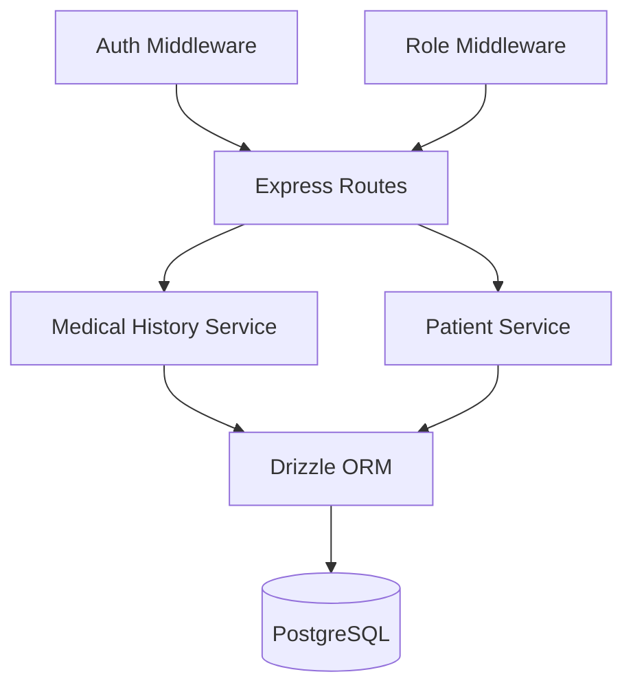

# Design Document: Patient Medical History

## Overview

This design implements a simple medical history tracking system for the AnamnesIA patient management platform. The system adds three new database tables (medical_conditions, medications, allergies) and integrates them with the existing patient management workflow.

The design prioritizes simplicity and speed of data entry. Each medical history type requires only a single name field, with all other fields optional. This minimal approach supports the future goal of AI voice input where doctors can quickly dictate entries during appointments.

The implementation follows existing patterns in the codebase:
- Drizzle ORM with PostgreSQL for data persistence
- Express.js REST API with Zod validation
- Service layer pattern for business logic
- Multi-tenant data isolation with tenant_id on all tables
- Cascade deletion when patients are removed

## Architecture

### System Components



The medical history feature integrates into the existing three-tier architecture:

1. **Routes Layer** (`/api/patients/:patientId/conditions|medications|allergies`): Handles HTTP requests, validates input with Zod schemas, enforces authentication/authorization
2. **Service Layer** (`medicalHistoryService.ts`): Contains business logic for CRUD operations, enforces tenant isolation
3. **Data Layer** (Drizzle ORM): Manages database queries and transactions

### Integration Points

The feature integrates with existing code at two points:

1. **Patient Detail Endpoint**: Extends `patientService.getById()` to include medical history alongside appointments
2. **Cascade Deletion**: Leverages existing foreign key constraints so medical history is automatically deleted when a patient is removed

### Data Flow

**Creating a Medical History Entry:**
```
Client Request → Auth Middleware → Route Handler → Zod Validation → 
Service Layer (tenant_id injection) → Drizzle ORM → PostgreSQL
```

**Retrieving Patient with Medical History:**
```
Client Request → Auth Middleware → patientService.getById() → 
[Parallel Queries: Patient + Appointments + Conditions + Medications + Allergies] → 
Aggregate Response → Client
```

## Components and Interfaces

### Database Schema

Three new tables following the existing schema patterns:

```typescript
// medical_conditions table
export const medicalConditions = pgTable(
  'medical_conditions',
  {
    id: uuid('id')
      .primaryKey()
      .default(sql`gen_random_uuid()`),
    tenantId: uuid('tenant_id')
      .notNull()
      .references(() => tenants.id, { onDelete: 'cascade' }),
    patientId: uuid('patient_id')
      .notNull()
      .references(() => patients.id, { onDelete: 'cascade' }),
    conditionName: text('condition_name').notNull(),
    diagnosedDate: text('diagnosed_date'), // Optional: YYYY-MM-DD format
    notes: text('notes'),
    createdAt: timestamp('created_at', { withTimezone: true }).defaultNow(),
    updatedAt: timestamp('updated_at', { withTimezone: true }).defaultNow(),
  },
  (table) => [
    index('idx_medical_conditions_tenant').on(table.tenantId),
    index('idx_medical_conditions_patient').on(table.patientId),
  ]
);

// medications table
export const medications = pgTable(
  'medications',
  {
    id: uuid('id')
      .primaryKey()
      .default(sql`gen_random_uuid()`),
    tenantId: uuid('tenant_id')
      .notNull()
      .references(() => tenants.id, { onDelete: 'cascade' }),
    patientId: uuid('patient_id')
      .notNull()
      .references(() => patients.id, { onDelete: 'cascade' }),
    medicationName: text('medication_name').notNull(),
    dosage: text('dosage'), // Optional: e.g., "500mg twice daily"
    notes: text('notes'),
    createdAt: timestamp('created_at', { withTimezone: true }).defaultNow(),
    updatedAt: timestamp('updated_at', { withTimezone: true }).defaultNow(),
  },
  (table) => [
    index('idx_medications_tenant').on(table.tenantId),
    index('idx_medications_patient').on(table.patientId),
  ]
);

// allergies table
export const allergies = pgTable(
  'allergies',
  {
    id: uuid('id')
      .primaryKey()
      .default(sql`gen_random_uuid()`),
    tenantId: uuid('tenant_id')
      .notNull()
      .references(() => tenants.id, { onDelete: 'cascade' }),
    patientId: uuid('patient_id')
      .notNull()
      .references(() => patients.id, { onDelete: 'cascade' }),
    allergenName: text('allergen_name').notNull(),
    allergyType: text('allergy_type', {
      enum: ['medication', 'food', 'other'],
    })
      .notNull()
      .default('other'),
    notes: text('notes'),
    createdAt: timestamp('created_at', { withTimezone: true }).defaultNow(),
    updatedAt: timestamp('updated_at', { withTimezone: true }).defaultNow(),
  },
  (table) => [
    index('idx_allergies_tenant').on(table.tenantId),
    index('idx_allergies_patient').on(table.patientId),
  ]
);
```

**Design Rationale:**
- All tables follow the same structure: id, tenant_id, patient_id, name field (required), optional fields, timestamps
- Foreign keys with `onDelete: 'cascade'` ensure medical history is removed when patients or tenants are deleted
- Indexes on tenant_id and patient_id optimize common query patterns
- Date fields stored as text (YYYY-MM-DD) for simplicity, matching existing `patients.dateOfBirth` pattern
- `allergyType` enum provides basic categorization while defaulting to "other" for flexibility

### API Endpoints

All endpoints require authentication and professional role (following existing pattern):

**Medical Conditions:**
- `POST /api/patients/:patientId/conditions` - Create condition
- `GET /api/patients/:patientId/conditions` - List all conditions for patient
- `PUT /api/patients/:patientId/conditions/:id` - Update condition
- `DELETE /api/patients/:patientId/conditions/:id` - Delete condition

**Medications:**
- `POST /api/patients/:patientId/medications` - Create medication
- `GET /api/patients/:patientId/medications` - List all medications for patient
- `PUT /api/patients/:patientId/medications/:id` - Update medication
- `DELETE /api/patients/:patientId/medications/:id` - Delete medication

**Allergies:**
- `POST /api/patients/:patientId/allergies` - Create allergy
- `GET /api/patients/:patientId/allergies` - List all allergies for patient
- `PUT /api/patients/:patientId/allergies/:id` - Update allergy
- `DELETE /api/patients/:patientId/allergies/:id` - Delete allergy

**Enhanced Patient Endpoint:**
- `GET /api/patients/:id` - Returns patient with appointments AND medical history

### Service Layer Interface

```typescript
// medicalHistoryService.ts

export interface MedicalConditionRow {
  id: string;
  tenant_id: string;
  patient_id: string;
  condition_name: string;
  diagnosed_date: string | null;
  notes: string | null;
  created_at: Date | null;
  updated_at: Date | null;
}

export interface MedicationRow {
  id: string;
  tenant_id: string;
  patient_id: string;
  medication_name: string;
  dosage: string | null;
  notes: string | null;
  created_at: Date | null;
  updated_at: Date | null;
}

export interface AllergyRow {
  id: string;
  tenant_id: string;
  patient_id: string;
  allergen_name: string;
  allergy_type: 'medication' | 'food' | 'other';
  notes: string | null;
  created_at: Date | null;
  updated_at: Date | null;
}

export interface CreateConditionInput {
  condition_name: string;
  diagnosed_date?: string | null;
  notes?: string | null;
}

export interface CreateMedicationInput {
  medication_name: string;
  dosage?: string | null;
  notes?: string | null;
}

export interface CreateAllergyInput {
  allergen_name: string;
  allergy_type?: 'medication' | 'food' | 'other';
  notes?: string | null;
}

// Medical Conditions
export async function listConditions(
  tenantId: string,
  patientId: string
): Promise<MedicalConditionRow[]>;

export async function createCondition(
  tenantId: string,
  patientId: string,
  input: CreateConditionInput
): Promise<MedicalConditionRow>;

export async function updateCondition(
  tenantId: string,
  patientId: string,
  id: string,
  input: Partial<CreateConditionInput>
): Promise<MedicalConditionRow | null>;

export async function deleteCondition(
  tenantId: string,
  patientId: string,
  id: string
): Promise<boolean>;

// Medications (similar pattern)
export async function listMedications(
  tenantId: string,
  patientId: string
): Promise<MedicationRow[]>;

export async function createMedication(
  tenantId: string,
  patientId: string,
  input: CreateMedicationInput
): Promise<MedicationRow>;

export async function updateMedication(
  tenantId: string,
  patientId: string,
  id: string,
  input: Partial<CreateMedicationInput>
): Promise<MedicationRow | null>;

export async function deleteMedication(
  tenantId: string,
  patientId: string,
  id: string
): Promise<boolean>;

// Allergies (similar pattern)
export async function listAllergies(
  tenantId: string,
  patientId: string
): Promise<AllergyRow[]>;

export async function createAllergy(
  tenantId: string,
  patientId: string,
  input: CreateAllergyInput
): Promise<AllergyRow>;

export async function updateAllergy(
  tenantId: string,
  patientId: string,
  id: string,
  input: Partial<CreateAllergyInput>
): Promise<AllergyRow | null>;

export async function deleteAllergy(
  tenantId: string,
  patientId: string,
  id: string
): Promise<boolean>;
```

**Service Layer Responsibilities:**
- Enforce tenant isolation by requiring tenant_id in all queries
- Validate that patient_id belongs to the tenant
- Transform database rows to API response format (camelCase to snake_case)
- Handle null/undefined values consistently
- Update `updated_at` timestamps on modifications

### Validation Schemas

```typescript
// Zod schemas for request validation

const createConditionSchema = z.object({
  condition_name: z.string().min(1, 'Condition name is required'),
  diagnosed_date: z.string().optional().nullable().or(z.literal('')),
  notes: z.string().optional().nullable(),
});

const updateConditionSchema = createConditionSchema.partial();

const createMedicationSchema = z.object({
  medication_name: z.string().min(1, 'Medication name is required'),
  dosage: z.string().optional().nullable(),
  notes: z.string().optional().nullable(),
});

const updateMedicationSchema = createMedicationSchema.partial();

const createAllergySchema = z.object({
  allergen_name: z.string().min(1, 'Allergen name is required'),
  allergy_type: z.enum(['medication', 'food', 'other']).optional(),
  notes: z.string().optional().nullable(),
});

const updateAllergySchema = createAllergySchema.partial();
```

## Data Models

### Medical Condition

Represents a diagnosed health condition (acute or chronic).

**Fields:**
- `id` (UUID, PK): Unique identifier
- `tenant_id` (UUID, FK, required): Isolates data by healthcare professional/practice
- `patient_id` (UUID, FK, required): Links to patient record
- `condition_name` (text, required): Name of the condition (e.g., "Type 2 Diabetes", "Hypertension")
- `diagnosed_date` (text, optional): Date of diagnosis in YYYY-MM-DD format
- `notes` (text, optional): Additional details about the condition
- `created_at` (timestamp): Record creation time
- `updated_at` (timestamp): Last modification time

**Constraints:**
- Foreign key to `tenants` with cascade delete
- Foreign key to `patients` with cascade delete
- Indexed on `tenant_id` and `patient_id`

### Medication

Represents a current or past medication.

**Fields:**
- `id` (UUID, PK): Unique identifier
- `tenant_id` (UUID, FK, required): Isolates data by healthcare professional/practice
- `patient_id` (UUID, FK, required): Links to patient record
- `medication_name` (text, required): Name of the medication (e.g., "Metformin", "Lisinopril")
- `dosage` (text, optional): Dosage and frequency (e.g., "500mg twice daily")
- `notes` (text, optional): Additional details about the medication
- `created_at` (timestamp): Record creation time
- `updated_at` (timestamp): Last modification time

**Constraints:**
- Foreign key to `tenants` with cascade delete
- Foreign key to `patients` with cascade delete
- Indexed on `tenant_id` and `patient_id`

### Allergy

Represents an allergic reaction to medications, foods, or other substances.

**Fields:**
- `id` (UUID, PK): Unique identifier
- `tenant_id` (UUID, FK, required): Isolates data by healthcare professional/practice
- `patient_id` (UUID, FK, required): Links to patient record
- `allergen_name` (text, required): Name of the allergen (e.g., "Penicillin", "Peanuts")
- `allergy_type` (enum, required, default='other'): Category of allergy ('medication', 'food', 'other')
- `notes` (text, optional): Additional details about the reaction
- `created_at` (timestamp): Record creation time
- `updated_at` (timestamp): Last modification time

**Constraints:**
- Foreign key to `tenants` with cascade delete
- Foreign key to `patients` with cascade delete
- Indexed on `tenant_id` and `patient_id`
- `allergy_type` must be one of: 'medication', 'food', 'other'

### Enhanced Patient Response

When retrieving a patient via `GET /api/patients/:id`, the response includes medical history:

```typescript
{
  patient: {
    id: string;
    tenant_id: string;
    first_name: string;
    last_name: string;
    // ... other patient fields
  },
  appointments: AppointmentWithSession[],
  medical_history: {
    conditions: MedicalConditionRow[];
    medications: MedicationRow[];
    allergies: AllergyRow[];
  }
}
```

**Ordering:**
- Conditions: `created_at DESC` (most recent first)
- Medications: `created_at DESC` (most recent first)
- Allergies: `allergen_name ASC` (alphabetical for quick scanning)


## Correctness Properties

A property is a characteristic or behavior that should hold true across all valid executions of a system—essentially, a formal statement about what the system should do. Properties serve as the bridge between human-readable specifications and machine-verifiable correctness guarantees.

### Property Reflection

After analyzing all acceptance criteria, I identified several areas of redundancy:

1. **Data structure validation (1.1, 2.1, 3.1)**: These three properties test the same pattern for different entity types. They can be combined into a single property about field storage.

2. **Foreign key associations (1.2, 2.2, 3.2)**: These test the same relationship pattern and can be combined.

3. **Multiple entries per patient (1.3, 2.3, 3.3)**: These test the same constraint absence and can be combined.

4. **Timestamp recording (1.5, 2.5, 3.5)**: These test the same automatic behavior and can be combined.

5. **Tenant isolation (4.2, 4.3, 6.5)**: Properties 4.3 and 6.5 are logically implied by 4.2. If queries filter by tenant_id, then access is prevented and operations are validated.

6. **Integration properties (5.1, 5.2)**: Property 5.2 is redundant with 5.1 - if medical history is included, it's alongside appointments.

7. **Minimal field requirements (7.1, 7.2, 7.3)**: These test the same validation pattern and can be combined.

After consolidation, we have 18 unique properties that provide comprehensive validation coverage.

### Property 1: Medical history entries store all specified fields

*For any* medical history entry (condition, medication, or allergy), when created with valid field values, the system should store all provided fields (required name field and any optional fields) and retrieve them unchanged.

**Validates: Requirements 1.1, 2.1, 3.1**

### Property 2: Medical history entries are associated with patient and tenant

*For any* medical history entry created for a patient, the entry should be associated with both the patient_id and tenant_id, and these associations should be retrievable from the database.

**Validates: Requirements 1.2, 2.2, 3.2**

### Property 3: Multiple medical history entries per patient

*For any* patient and any number of medical history entries (conditions, medications, or allergies), the system should allow creating and storing all entries without constraint violations.

**Validates: Requirements 1.3, 2.3, 3.3**

### Property 4: Conditions retrieved in descending chronological order

*For any* patient with multiple conditions, when retrieving the patient record, all conditions should be returned ordered by created_at timestamp in descending order (most recent first).

**Validates: Requirements 1.4**

### Property 5: Medications retrieved in descending chronological order

*For any* patient with multiple medications, when retrieving the patient record, all medications should be returned ordered by created_at timestamp in descending order (most recent first).

**Validates: Requirements 2.4**

### Property 6: Allergies retrieved in alphabetical order

*For any* patient with multiple allergies, when retrieving the patient record, all allergies should be returned ordered by allergen_name in ascending alphabetical order.

**Validates: Requirements 3.4**

### Property 7: Automatic timestamp generation and updates

*For any* medical history entry, the system should automatically set created_at on creation and update updated_at whenever the entry is modified, with updated_at being greater than or equal to created_at.

**Validates: Requirements 1.5, 2.5, 3.5, 6.4**

### Property 8: Allergy type defaults to "other"

*For any* allergy created without specifying allergy_type, the system should default the allergy_type field to "other".

**Validates: Requirements 3.6**

### Property 9: Tenant ID required for creation

*For any* attempt to create a medical history entry without a valid tenant_id, the system should reject the operation with a validation error.

**Validates: Requirements 4.1**

### Property 10: Tenant isolation in queries

*For any* query for medical history entries with a specific tenant_id, the system should return only entries belonging to that tenant and exclude all entries from other tenants.

**Validates: Requirements 4.2, 4.3, 6.5**

### Property 11: Cascade deletion of medical history

*For any* patient with associated medical history entries (conditions, medications, allergies), when the patient is deleted, all associated medical history entries should also be deleted from the database.

**Validates: Requirements 4.4**

### Property 12: Patient retrieval includes medical history

*For any* patient, when retrieving patient details by patient_id, the response should include three medical history arrays: conditions, medications, and allergies.

**Validates: Requirements 5.1, 5.2**

### Property 13: Update operations modify fields except patient_id and tenant_id

*For any* medical history entry, update operations should successfully modify the name field, optional fields, and notes, but should not modify patient_id or tenant_id (these fields should remain unchanged after update attempts).

**Validates: Requirements 6.2**

### Property 14: Delete operations remove entries

*For any* medical history entry, when deleted by id and tenant_id, the entry should no longer exist in the database and subsequent queries should not return it.

**Validates: Requirements 6.3**

### Property 15: Only name field required for creation

*For any* medical history entry type (condition, medication, allergy), creating an entry with only the required name field (and no optional fields) should succeed and store the entry.

**Validates: Requirements 7.1, 7.2, 7.3**

### Property 16: Empty or missing name field causes validation error

*For any* attempt to create a medical history entry with a missing, null, or empty string name field, the system should return a validation error and not create the entry.

**Validates: Requirements 7.4**

### Property 17: Optional fields accept null or empty values

*For any* medical history entry, all optional fields (diagnosed_date, dosage, notes, allergy_type) should accept null values or empty strings without causing validation errors.

**Validates: Requirements 7.5**

### Property 18: Round-trip data integrity

*For any* medical history entry with randomly generated valid field values, creating the entry and then retrieving it should return an entry with identical field values (round-trip property).

**Validates: Requirements 1.1, 2.1, 3.1** (additional validation)


## Error Handling

The medical history system follows the existing error handling patterns in the codebase:

### Validation Errors (400 Bad Request)

**Trigger Conditions:**
- Missing or empty required name field (condition_name, medication_name, allergen_name)
- Invalid allergy_type value (not one of: 'medication', 'food', 'other')
- Malformed request body that fails Zod schema validation

**Response Format:**
```typescript
{
  statusCode: 400,
  message: "Invalid [condition|medication|allergy] data"
}
```

**Implementation:**
- Zod schemas validate input before reaching service layer
- Route handlers catch Zod validation failures and return 400 errors
- Service layer assumes validated input

### Authorization Errors (403 Forbidden)

**Trigger Conditions:**
- Missing authentication token
- User lacks 'professional' role
- Missing tenant_id in authenticated user context

**Response Format:**
```typescript
{
  statusCode: 403,
  message: "Forbidden"
}
```

**Implementation:**
- `authenticate` middleware validates JWT token
- `requireRole('professional')` middleware checks user role
- Route handlers verify tenant_id exists before calling service layer

### Not Found Errors (404 Not Found)

**Trigger Conditions:**
- Patient ID does not exist or belongs to different tenant
- Medical history entry ID does not exist or belongs to different tenant
- Attempting to update or delete non-existent entry

**Response Format:**
```typescript
{
  statusCode: 404,
  message: "[Patient|Condition|Medication|Allergy] not found"
}
```

**Implementation:**
- Service layer returns `null` when queries find no matching records
- Route handlers check for `null` and throw 404 errors
- All queries include tenant_id filter to prevent cross-tenant access

### Database Errors (500 Internal Server Error)

**Trigger Conditions:**
- Database connection failures
- Constraint violations (e.g., invalid foreign key)
- Unexpected database errors

**Response Format:**
```typescript
{
  statusCode: 500,
  message: "Internal server error"
}
```

**Implementation:**
- Express error handling middleware catches unhandled exceptions
- Database errors propagate to error middleware
- Sensitive error details are logged but not exposed to clients

### Cascade Deletion Behavior

When a patient is deleted, PostgreSQL automatically deletes all associated medical history entries due to `onDelete: 'cascade'` foreign key constraints. This is not an error condition but expected behavior that maintains referential integrity.

## Testing Strategy

The medical history feature requires comprehensive testing using both unit tests and property-based tests. This dual approach ensures both specific edge cases and general correctness across all inputs.

### Property-Based Testing

Property-based testing validates universal properties across many randomly generated inputs. This approach is particularly valuable for the medical history system because it tests tenant isolation, data integrity, and CRUD operations across a wide range of scenarios.

**Library Selection:**
- **fast-check** for TypeScript/Node.js property-based testing
- Minimum 100 iterations per property test (due to randomization)
- Each test references its design document property

**Property Test Configuration:**

Each property-based test should:
1. Run at least 100 iterations with randomly generated inputs
2. Include a comment tag: `// Feature: patient-medical-history, Property {number}: {property_text}`
3. Use fast-check arbitraries to generate valid test data
4. Test the property across all three medical history types where applicable

**Example Property Test Structure:**

```typescript
import fc from 'fast-check';

// Feature: patient-medical-history, Property 10: Tenant isolation in queries
test('queries only return entries for specified tenant', () => {
  fc.assert(
    fc.asyncProperty(
      fc.uuid(), // tenant1
      fc.uuid(), // tenant2
      fc.uuid(), // patientId
      fc.string({ minLength: 1 }), // conditionName
      async (tenant1, tenant2, patientId, conditionName) => {
        // Create condition for tenant1
        await createCondition(tenant1, patientId, { condition_name: conditionName });
        
        // Query with tenant2 should return empty
        const results = await listConditions(tenant2, patientId);
        expect(results).toHaveLength(0);
        
        // Query with tenant1 should return the condition
        const results1 = await listConditions(tenant1, patientId);
        expect(results1).toHaveLength(1);
      }
    ),
    { numRuns: 100 }
  );
});
```

**Property Test Coverage:**

The following properties should be implemented as property-based tests:

- **Property 1**: Field storage integrity (test with random field values)
- **Property 2**: Foreign key associations (test with random IDs)
- **Property 3**: Multiple entries per patient (test with random entry counts)
- **Property 4-6**: Ordering properties (test with random timestamps/names)
- **Property 7**: Timestamp generation (test with random updates)
- **Property 8**: Default allergy type (test with random allergen names)
- **Property 10**: Tenant isolation (test with random tenant IDs)
- **Property 11**: Cascade deletion (test with random entry counts)
- **Property 12**: Patient retrieval includes medical history (test with random patients)
- **Property 13**: Update immutability (test with random update values)
- **Property 14**: Delete operations (test with random entries)
- **Property 15**: Minimal field requirements (test with random names)
- **Property 16**: Validation errors (test with empty/null names)
- **Property 17**: Optional field acceptance (test with random null/empty values)
- **Property 18**: Round-trip integrity (test with random field combinations)

### Unit Testing

Unit tests complement property-based tests by validating specific examples, edge cases, and integration points. They provide concrete, readable examples of expected behavior.

**Unit Test Focus Areas:**

1. **Specific Examples:**
   - Creating a condition with all fields populated
   - Creating a medication with only the name field
   - Creating an allergy with type "medication"
   - Updating a condition's diagnosed_date
   - Deleting a medication

2. **Edge Cases:**
   - Patient with no medical history returns empty arrays (Property 12 edge case)
   - Updating an entry with no changes returns unchanged entry
   - Deleting already-deleted entry returns false
   - Creating entry with empty string for optional fields

3. **Integration Tests:**
   - GET /api/patients/:id returns medical history alongside appointments
   - Cascade deletion removes all medical history when patient deleted
   - Authentication middleware blocks unauthenticated requests
   - Role middleware blocks non-professional users

4. **Error Conditions:**
   - Missing required name field returns 400
   - Invalid allergy_type returns 400
   - Non-existent patient ID returns 404
   - Cross-tenant access attempt returns 404 (not 403, due to filtering)
   - Malformed request body returns 400

**Unit Test Structure:**

```typescript
describe('Medical History Service', () => {
  describe('createCondition', () => {
    it('should create condition with all fields', async () => {
      const input = {
        condition_name: 'Type 2 Diabetes',
        diagnosed_date: '2023-01-15',
        notes: 'Controlled with medication'
      };
      
      const result = await createCondition(tenantId, patientId, input);
      
      expect(result.condition_name).toBe(input.condition_name);
      expect(result.diagnosed_date).toBe(input.diagnosed_date);
      expect(result.notes).toBe(input.notes);
      expect(result.patient_id).toBe(patientId);
      expect(result.tenant_id).toBe(tenantId);
    });
    
    it('should create condition with only name field', async () => {
      const input = { condition_name: 'Hypertension' };
      
      const result = await createCondition(tenantId, patientId, input);
      
      expect(result.condition_name).toBe(input.condition_name);
      expect(result.diagnosed_date).toBeNull();
      expect(result.notes).toBeNull();
    });
  });
});
```

### Test Data Management

**Test Database:**
- Use separate test database or transactions that rollback after each test
- Seed test data for tenants and patients before medical history tests
- Clean up test data after each test suite

**Test Fixtures:**
- Create helper functions for generating valid test data
- Use factories for creating patients, conditions, medications, allergies
- Maintain consistent test tenant IDs and patient IDs across tests

**Fast-check Arbitraries:**

```typescript
// Custom arbitraries for medical history testing
const conditionArbitrary = fc.record({
  condition_name: fc.string({ minLength: 1, maxLength: 100 }),
  diagnosed_date: fc.option(fc.date().map(d => d.toISOString().split('T')[0])),
  notes: fc.option(fc.string({ maxLength: 500 }))
});

const medicationArbitrary = fc.record({
  medication_name: fc.string({ minLength: 1, maxLength: 100 }),
  dosage: fc.option(fc.string({ maxLength: 100 })),
  notes: fc.option(fc.string({ maxLength: 500 }))
});

const allergyArbitrary = fc.record({
  allergen_name: fc.string({ minLength: 1, maxLength: 100 }),
  allergy_type: fc.option(fc.constantFrom('medication', 'food', 'other')),
  notes: fc.option(fc.string({ maxLength: 500 }))
});
```

### Testing Balance

The testing strategy balances unit tests and property tests:

- **Property tests** handle comprehensive input coverage, testing that properties hold across all valid inputs (100+ iterations per property)
- **Unit tests** handle specific examples, edge cases, and integration scenarios that demonstrate concrete behavior
- Together, they provide confidence that the system works correctly for both general cases and specific scenarios

Avoid writing too many unit tests that simply test different input values—property tests handle that more efficiently. Focus unit tests on specific examples that illustrate expected behavior and edge cases that need explicit validation.

### Continuous Integration

All tests should run in CI pipeline:
- Run unit tests first (faster feedback)
- Run property-based tests with 100 iterations
- Fail build if any test fails
- Generate coverage reports (aim for >80% coverage)
- Run tests against PostgreSQL (not SQLite) to match production

